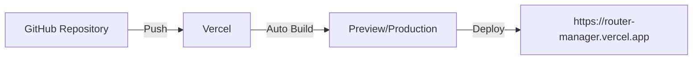

<div align="center">

# Router Manager

### Plataforma de Gestión Logística

[](https://reactjs.org/)
[](https://vitejs.dev/)
[](https://www.typescriptlang.org/)
[](https://firebase.google.com/)

<p align="center">
  
  
  
</p>

---

</div>

## 📋 Tabla de Contenidos

- [Sobre el Proyecto](#-sobre-el-proyecto)
- [Comenzando](#-comenzando)
- [Pre-requisitos](#-pre-requisitos)
- [Instalación](#-instalación)
- [Arquitectura del Proyecto](#️-arquitectura-del-proyecto)
- [Scripts Disponibles](#-scripts-disponibles)
- [Despliegue](#-despliegue)
- [Tecnologías Usadas](#️-tecnologías-usadas)
- [Versionado](#-versionado)
- [Autores](#️-autores)


---

## 🎯 Sobre el Proyecto

**Router Manager** es una plataforma web diseñada para revolucionar la gestión logística en empresas de mensajería y transporte. Nuestra solución optimiza las operaciones mediante:

- 📍 **Seguimiento GPS en tiempo real**
- 🗺️ **Gestión inteligente de rutas**
- 📦 **Control centralizado de paquetes**
- 📊 **Monitoreo logístico avanzado**
- ⚡ **Optimización de tiempos de entrega**

### 🎯 Objetivos Principales

- ⏱️ **Optimizar tiempos de entrega**
- 💰 **Reducir costos operativos**
- 📈 **Mejorar el flujo de trabajo**
- 👥 **Facilitar la comunicación entre equipos**

> 💡 **Desarrollado con y para el sector logístico:** Todas las funcionalidades fueron diseñadas según las problemáticas reales identificadas por conductores y administradores logísticos.

---

## 🚀 Comenzando

### Repositorio del Proyecto

```
https://github.com/juancapera26/route-manager.git
```

### Clonar el Proyecto

Puedes clonar el repositorio usando alguna de las opciones disponibles en GitHub:

**Opción 1: HTTPS**
```bash
git clone https://github.com/juancapera26/route-manager.git
```

**Opción 2: SSH**
```bash
git clone git@github.com:juancapera26/route-manager.git
```

**Opción 3: GitHub CLI**
```bash
gh repo clone juancapera26/route-manager
```

### Navegar al directorio

```bash
cd route-manager
```

---

## 📦 Pre-requisitos

Antes de instalar las dependencias, asegúrate de tener instalado lo siguiente en tu sistema:

| Herramienta | Versión Recomendada | Descarga |
|------------|---------------------|----------|
|  | 18.x o superior | [Descargar](https://nodejs.org/) |
|  | 9.x o superior | Incluido con Node.js |
|  | 1.22 o superior | [Descargar](https://yarnpkg.com/) |
|  | Última versión | [Descargar](https://git-scm.com/) |

### 🔐 Archivos de Configuración Requeridos

El proyecto requiere los siguientes archivos de configuración:

```
/secrets
    └── credenciales-firebase.json    # Credenciales de Firebase
.env                                   # Variables de entorno
```

> ⚠️ **Importante:** Estos archivos contienen información sensible y no están incluidos en el repositorio. Solicítalos al equipo de desarrollo.

---

## 🔧 Instalación

### Paso 1: Instalar dependencias

Usando **Yarn** (recomendado):
```bash
yarn install
```

O usando **npm**:
```bash
npm install
```

<details>
<summary>💡 ¿Qué hace este comando?</summary>

Este comando descarga e instala todas las dependencias necesarias definidas en `package.json`, incluyendo:
- React y React DOM
- Vite para el bundling
- Firebase para autenticación y storage
- Librerías de utilidad y componentes
- Herramientas de desarrollo

</details>

### Paso 2: Configurar variables de entorno

Crea un archivo `.env` en la raíz del proyecto con las siguientes variables:

```env
# Firebase Configuration
VITE_FIREBASE_API_KEY=tu-api-key
VITE_FIREBASE_AUTH_DOMAIN=tu-auth-domain
VITE_FIREBASE_PROJECT_ID=tu-project-id
VITE_FIREBASE_STORAGE_BUCKET=tu-storage-bucket
VITE_FIREBASE_MESSAGING_SENDER_ID=tu-sender-id
VITE_FIREBASE_APP_ID=tu-app-id

# API Configuration
VITE_API_URL=https://api.router-manager.com
```

### Paso 3: Agregar credenciales de Firebase

Coloca el archivo `credenciales-firebase.json` en la carpeta `/secrets`:

```
/secrets
    └── credenciales-firebase.json
```

<div align="center">

### 🎉 ¡Listo! Ya puedes iniciar el proyecto

</div>

---

## 🏗️ Arquitectura del Proyecto

Router Manager utiliza una arquitectura en capas basada en componentes, permitiendo mantener una estructura limpia, escalable y fácil de mantener.

```
src/
│
├── components/          # Componentes reutilizables
│   ├── common/         # Componentes genéricos (botones, inputs, etc.)
│   ├── layout/         # Componentes de estructura (header, sidebar)
│   └── features/       # Componentes específicos de funcionalidades
│
├── pages/              # Páginas del sistema
│   ├── Dashboard/      # Panel principal
│   ├── Routes/         # Gestión de rutas
│   ├── Packages/       # Gestión de paquetes
│   └── Auth/           # Autenticación
│
├── services/           # Lógica de negocio y consumo de APIs
│   ├── api/           # Configuración de APIs
│   ├── firebase/      # Servicios de Firebase
│   └── storage/       # Gestión de almacenamiento
│
├── hooks/              # Hooks personalizados
│   ├── useAuth.ts     # Hook de autenticación
│   ├── useRoutes.ts   # Hook de rutas
│   └── usePackages.ts # Hook de paquetes
│
├── assets/             # Recursos estáticos
│   ├── images/        # Imágenes
│   ├── icons/         # Íconos
│   └── styles/        # Estilos globales
│
├── utils/              # Utilidades generales
│   ├── helpers/       # Funciones auxiliares
│   ├── constants/     # Constantes del proyecto
│   └── validators/    # Validadores
│
└── types/              # Definiciones de TypeScript
    └── index.ts       # Tipos globales

secrets/                # Credenciales privadas (no versionado)
    └── credenciales-firebase.json

.env                    # Variables de entorno (no versionado)
vite.config.ts          # Configuración de Vite
tsconfig.json           # Configuración de TypeScript
package.json            # Dependencias del proyecto
```

### 📁 Descripción de Carpetas Principales

| Carpeta | Descripción |
|---------|-------------|
| **components/** | Componentes React reutilizables organizados por tipo |
| **pages/** | Páginas principales de la aplicación |
| **services/** | Lógica de negocio, llamadas a APIs y servicios externos |
| **hooks/** | Custom hooks para lógica compartida |
| **assets/** | Archivos estáticos (imágenes, estilos, íconos) |
| **utils/** | Funciones auxiliares y utilidades |
| **types/** | Definiciones de tipos TypeScript |

---

## 💻 Scripts Disponibles

### 🚀 Desarrollo

Iniciar el servidor de desarrollo con hot-reload:

```bash
# Con npm
npm run dev

# Con yarn
yarn dev
```

El proyecto estará disponible en `http://localhost:5173`

### 🏗️ Producción

Construir el proyecto para producción:

```bash
# Con npm
npm run build

# Con yarn
yarn build
```

Este comando:
- Compila el código TypeScript
- Optimiza los assets
- Genera el bundle en la carpeta `dist/`

### 👀 Vista Previa

Visualizar el build de producción localmente:

```bash
# Con npm
npm run preview

# Con yarn
yarn preview
```

## 📦 Despliegue

### 🌐 Deployment en Vercel

Router Manager se despliega automáticamente en Vercel para un proceso ágil y sin complicaciones.

<div align="center">



</div>

### 📋 Pasos para el Despliegue

#### 1️⃣ Crear una cuenta en Vercel

Visita [vercel.com](https://vercel.com) y crea una cuenta gratuita.

#### 2️⃣ Subir el proyecto a GitHub

```bash
git add .
git commit -m "Preparar proyecto para deployment"
git push origin main
```

#### 3️⃣ Conectar el repositorio en Vercel

1. En el dashboard de Vercel, haz clic en **"New Project"**
2. Importa tu repositorio desde GitHub
3. Vercel detectará automáticamente que es un proyecto Vite

#### 4️⃣ Configurar los comandos de build

Vercel detectará automáticamente la configuración, pero verifica que sea:

- **Build Command:** `npm run build` o `yarn build`
- **Output Directory:** `dist`
- **Install Command:** `npm install` o `yarn install`

#### 5️⃣ Agregar las variables de entorno

En la configuración del proyecto en Vercel, agrega todas las variables del archivo `.env`:

```
VITE_FIREBASE_API_KEY
VITE_FIREBASE_AUTH_DOMAIN
VITE_FIREBASE_PROJECT_ID
VITE_FIREBASE_STORAGE_BUCKET
VITE_FIREBASE_MESSAGING_SENDER_ID
VITE_FIREBASE_APP_ID
VITE_API_URL
```

#### 6️⃣ Deploy

Haz clic en **"Deploy"** y Vercel:
- Clonará el repositorio
- Instalará las dependencias
- Ejecutará el build
- Desplegará automáticamente

### 🔄 Despliegue Continuo

Una vez configurado, cada push a la rama principal desplegará automáticamente:

- **Commits a `main`** → Producción
- **Pull Requests** → Preview deployments
- **Otras ramas** → Preview deployments (opcional)

### 🔍 Monitoreo del Deploy

Vercel proporciona:
- ✅ Logs en tiempo real
- 📊 Analytics de rendimiento
- 🔗 URLs de preview para cada commit
- 🚨 Notificaciones de errores

> 💡 **Tip:** Conecta las notificaciones de Vercel con Slack o Discord para recibir actualizaciones del deploy en tiempo real.

---

## 🛠️ Tecnologías Usadas

<div align="center">

### Stack Principal

<table>
<tr>
<td align="center" width="25%">

<br><strong>React 18+</strong>
<br><sub>Librería de UI</sub>
</td>
<td align="center" width="25%">

<br><strong>Vite 5.0+</strong>
<br><sub>Build tool</sub>
</td>
<td align="center" width="25%">

<br><strong>TypeScript 5.0+</strong>
<br><sub>Lenguaje tipado</sub>
</td>
<td align="center" width="25%">

<br><strong>Firebase</strong>
<br><sub>Backend services</sub>
</td>
</tr>
</table>

### Herramientas y Servicios

| Categoría | Tecnología | Propósito |
|-----------|------------|-----------|
| 🎨 **UI/UX** | React + Vite | Interfaz de usuario reactiva y rápida |
| 💻 **Lenguaje** | JavaScript / TypeScript | Lógica del sistema con tipado estático |
| 🔐 **Autenticación** | Firebase Auth | Gestión de usuarios y sesiones |
| 📦 **Storage** | Firebase Storage | Gestión y almacenamiento de archivos |
| 🎨 **Estilos** | CSS / Tailwind CSS | Diseño responsive y moderno |
| 🚀 **Deploy** | Vercel | Hosting y despliegue continuo |
| 🔄 **Versionado** | Git & GitHub | Control de versiones |
| 📱 **Responsivo** | Mobile First | Diseño adaptable a todos los dispositivos |

</div>

### 🔥 Firebase Services

El proyecto integra los siguientes servicios de Firebase:

- **Firebase Authentication:** Manejo de autenticación de usuarios
- **Firebase Storage:** Almacenamiento de archivos y documentos
- **Firebase Firestore:** Base de datos en tiempo real (si aplica)
- **Firebase Hosting:** Alternativa de hosting (opcional)

---

## 📌 Versionado

El versionado del proyecto se realiza siguiendo las mejores prácticas de control de versiones:

### Estrategia de Versionado

Utilizamos **Semantic Versioning (SemVer)** con el formato `MAJOR.MINOR.PATCH`:

- **MAJOR:** Cambios incompatibles con versiones anteriores
- **MINOR:** Nueva funcionalidad compatible con versiones anteriores
- **PATCH:** Correcciones de bugs compatibles

### 🏷️ Tags en Git

Cada versión importante se marca con un tag:

```bash
# Crear un nuevo tag
git tag -a v1.0.0 -m "Versión 1.0.0 - Release inicial"

# Subir el tag al repositorio
git push origin v1.0.0

# Listar todos los tags
git tag -l
```

### 📦 Releases en GitHub

Cada versión se documenta en GitHub Releases con:

- 📝 Notas de la versión (changelog)
- 🐛 Bugs corregidos
- ✨ Nuevas funcionalidades
- ⚠️ Breaking changes
- 📦 Assets descargables (si aplica)

### 📊 Historial de Versiones

| Versión | Fecha | Descripción |
|---------|-------|-------------|
| v1.0.0 | 2024 | Release inicial con funcionalidades core |

---

## ✒️ Autores

<div align="center">

### 👥 Equipo de Desarrollo

<table>
<tr>
<td align="center">
<a href="https://github.com/juancapera26">
<br>
<sub><b>Juan Capera</b></sub>
</a><br>
<sub>🚀 Líder del Proyecto</sub><br>
<sub>Full Stack Developer</sub><br>
<a href="https://github.com/juancapera26">💻</a>
<a href="mailto:juan@example.com">📧</a>
</td>
<td align="center">
<a href="https://github.com/jairduarte">
<br>
<sub><b>Jair Duarte</b></sub>
</a><br>
<sub>👨‍💻 Desarrollador</sub><br>
<sub>Full Stack Developer</sub><br>
<a href="https://github.com/jairduarte">💻</a>
<a href="mailto:jair@example.com">📧</a>
</td>
<td align="center">
<a href="https://github.com/josebecerra">
<br>
<sub><b>José Becerra</b></sub>
</a><br>
<sub>👨‍💻 Desarrollador</sub><br>
<sub>Full Stack Developer</sub><br>
<a href="https://github.com/josebecerra">💻</a>
<a href="mailto:jose@example.com">📧</a>
</td>
</tr>
</table>

### 🤝 Contribuciones

Cada miembro del equipo contribuyó en:

- **Juan Capera:** Arquitectura del proyecto, desarrollo principal, coordinación del equipo
- **Jair Duarte:** Desarrollo de funcionalidades core, integración de APIs
- **José Becerra:** Diseño de componentes, optimización de rendimiento

</div>
</div>
